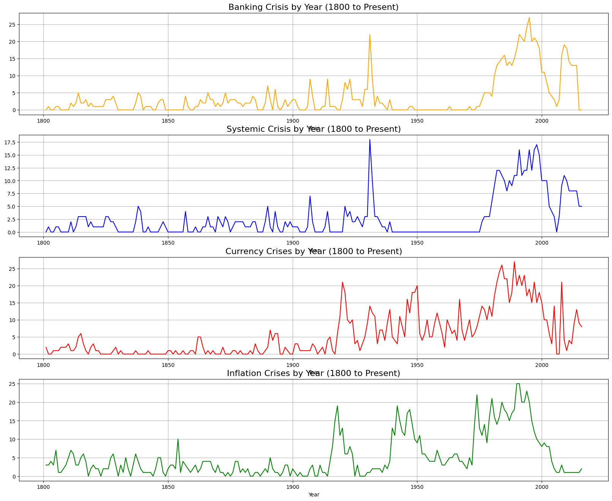
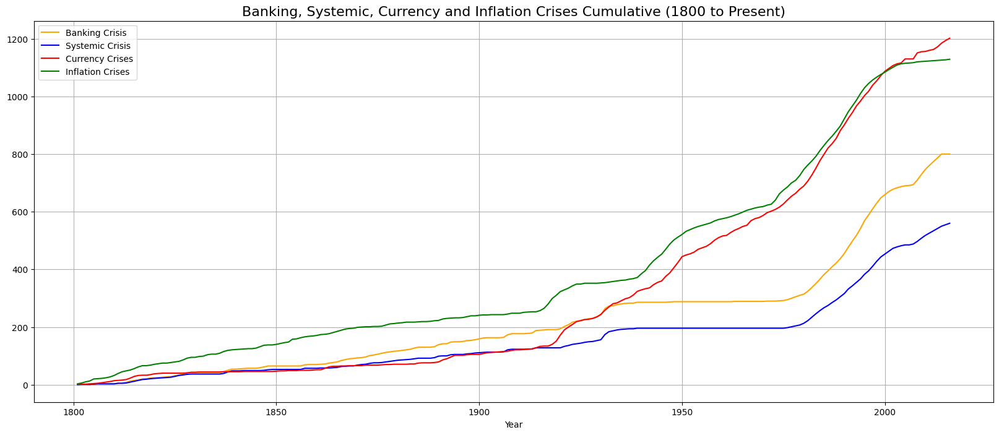
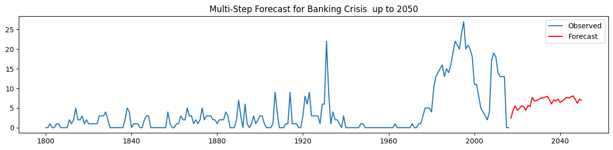
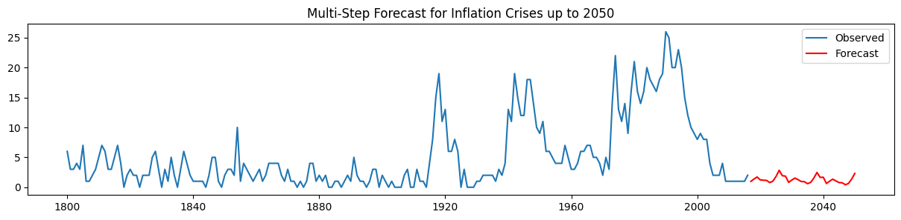

# 📉 Financial Crisis Analysis Studio
**Quantitative Deep-Dive into Global Systemic Risk (1800 – Present)**

## 📌 Project Overview
This repository serves as a professional analytical framework for studying the long-term patterns of global financial instability. Utilizing over 200 years of historical data, this project examines the evolution and interplay of four primary crisis types: **Banking, Systemic, Currency, and Inflation**. 

The objective is to move beyond simple visualization to provide statistical evidence of how economic shocks propagate across borders and time, culminating in predictive forecasting through 2050.

---

## 🌎 Geospatial Risk Distribution
Understanding the geographical "footprint" of financial instability is critical for regional risk assessment. This analysis utilizes geospatial mapping to identify historical hotspots for specific crisis regimes.

  

**Key Finding:** Historical data reveals significant "Crisis Specialization" across regions—with Inflation crises showing higher density in emerging markets, while Banking crises cluster in highly integrated financial hubs.

---

## 🔍 Comprehensive Crisis Analysis (4-Type Model)

### 1. Longitudinal Frequency (1800–Present)
This multi-panel time-series analysis tracks the annual frequency of all four crisis types. It effectively captures the "Great Moderation" and the subsequent resurgence of volatility in the modern era.

  

### 2. Cumulative Systemic Stress
The cumulative growth chart identifies critical "inflection points" in global economic history. Post-1970 data shows a marked acceleration in systemic risk, coinciding with the shift to floating exchange rates and increased capital mobility.

  

---

## 🧪 Statistical Rigor & Diagnostics

### Feature Correlation
Using a Pearson Correlation Heatmap, I quantified the dependencies between crisis types. The **0.73 correlation** between Banking and Systemic crises is a primary lead indicator used in the predictive model.

  

---

## 📈 Forecasting the Next Frontier (2020–2050)
The final stage of the project involves multi-step forecasting for each crisis type. These models project potential volatility regimes over the next three decades based on historical cyclicality.

  
  

  
  

---
### Technical Interpretation:
* **Systemic Risk Escalation:** The model predicts a steady upward trajectory in systemic risk, rising to a probability of **22.30% by 2036**. This suggests that as global markets become more interconnected, the "contagion effect" of localized shocks is likely to intensify.
* **Banking Sector Fragility:** Forecasts suggest a stable but persistent risk probability of **14.80%**. The cyclical "spikes" in the forecast indicate that banking institutions remain highly sensitive to interest rate pivots and debt cycles.
* **Currency & Inflation Volatility:** Projections show high-amplitude swings in currency risk. This reflects the "Behavioral" aspect of the study—investor sentiment and panic often lead to self-fulfilling prophecies in currency devaluations.

---
## 🛠 Tech Stack
* **Languages:** Python (Pandas, NumPy, Scipy)
* **Econometrics:** Statsmodels (ARIMA, Time-Series Decomposition, ACF/PACF)
* **Visualization:** Matplotlib, Seaborn, Geopandas (Geospatial Mapping)
* **Environment:** Google Colab / Jupyter

---
*Maintained by **DHARKIVE-STUDIO***
